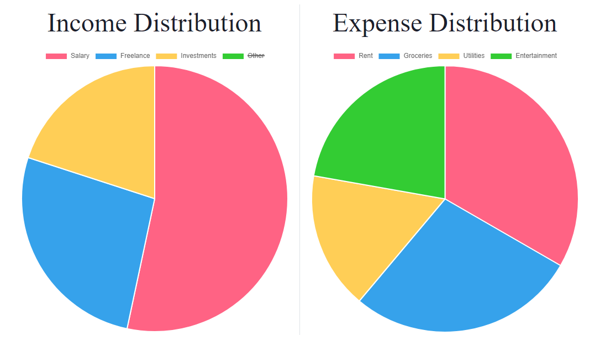
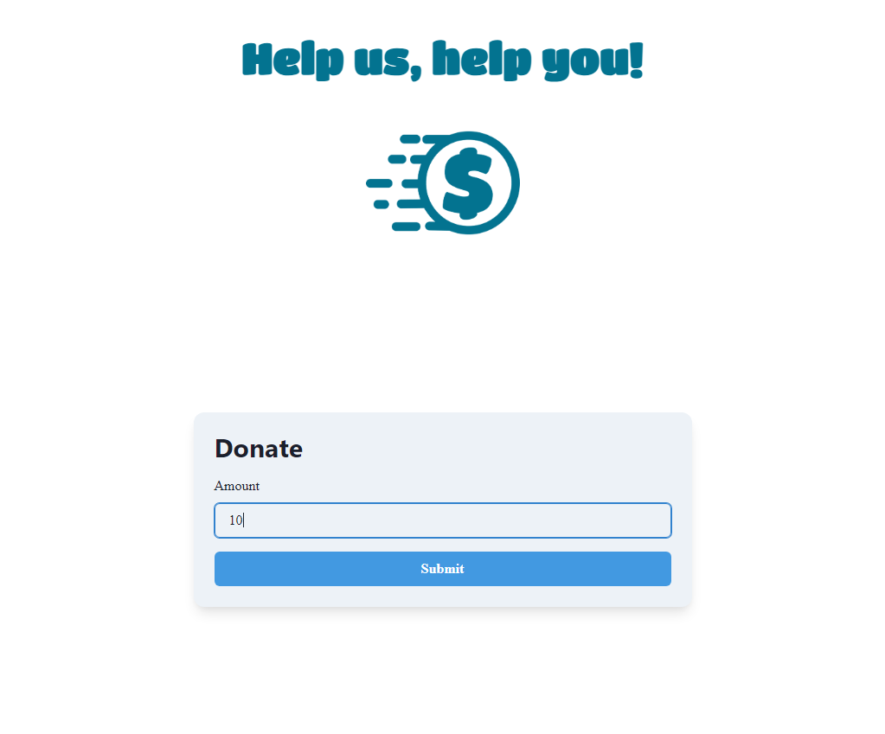

# BudgetWise

## Description

An online web application that allows users to track their finances. This includes, income, expenses, budgetting, and more! This application was developed using the MERN stack. Our app also has a donation page integrated with Stripe.

## Table of Contents

1. [Installation](#installation)
2. [Usage](#usage)
3. [Demo](#demo)
4. [Credits](#credits)
5. [License](#license)
6. [Questions](#questions)

## Installation

To use locally `git clone` this repository. open the terminal and type `npm install` followed by `npm run develop`.

## Usage

Visit the deployed app at https://afternoon-tundra-66898-d64f284645ec.herokuapp.com/ 

## Demo

Below are some images of the deployed site!

## Credits

- [Gurveer Madurai](https://github.com/gurverm)
- [Andy Zhong](https://github.com/TimeBytes)
- [Mahdi Moradzadeh](https://github.com/Mahdi-Moradzadeh)
- [Kajian Pulenthirasingam](https://github.com/kajianpulenthirasingam)
- [Mahdi El-Harake](https://github.com/mahdi83777)

## License

This project is licensed under mit
https://opensource.org/licenses/MIT

## Questions

If you have any additional questions regarding this project please contact me at maduraigurveer@gmail.com.
You can view more of my work at https://github.com/gurverm
